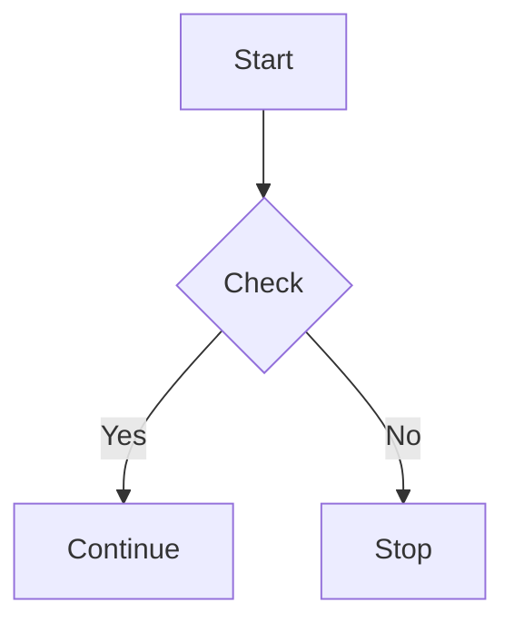

# RenderMaid

A high-performance, functional TypeScript library for parsing and rendering Mermaid diagrams. Built with modern functional programming principles, featuring optimized parsing, intelligent edge routing, and multi-format output.

[](https://jsr.io/@rendermaid/core)

## ✨ Features

- **🚀 High Performance**: Optimized tokenization-based parser with spatial grid rendering
- **🎯 Functional Architecture**: Immutable data structures and pure functions throughout
- **📊 Multi-format Output**: SVG, HTML, JSON, and round-trip Mermaid rendering
- **🔄 Smart Edge Routing**: Intelligent collision avoidance for clean diagrams  
- **📱 Professional Styling**: White backgrounds with proper contrast and typography
- **⚡ Type-Safe**: Full TypeScript support with discriminated unions and pattern matching
- **🧪 Comprehensive Testing**: Performance benchmarks and validation included

## 🚀 Quick Start

### Installation

```bash
# Deno
deno add @rendermaid/core

# Node.js/Bun
npx jsr add @rendermaid/core
```

### Basic Usage

```typescript
import { parseMermaid, renderSvg } from "@rendermaid/core";

const diagram = `
flowchart TD
  A[Start] --> B{Decision}
  B -->|Yes| C[Process A]
  B -->|No| D[Process B]
  C --> E[End]
  D --> E[End]
`;

// Parse the diagram
const parseResult = parseMermaid(diagram);

if (parseResult.success) {
  // Render to SVG
  const svgResult = renderSvg(parseResult.data, {
    width: 800,
    height: 600,
    theme: "light"
  });
  
  if (svgResult.success) {
    console.log(svgResult.data); // SVG string
  }
}
```

## 📚 API Reference

### Core Functions

#### `parseMermaid(input: string): Result<MermaidAST>`

Parses a Mermaid diagram string into an Abstract Syntax Tree.

```typescript
const result = parseMermaid(`
flowchart LR
  A([User Input]) --> B{Validate}
  B -->|Valid| C[Process Data]
  B -->|Invalid| D[Show Error]
`);
```

#### Rendering Functions

**SVG Rendering**
```typescript
renderSvg(ast: MermaidAST, config?: Partial<SvgConfig>): Result<string>

// Example
const svg = renderSvg(ast, {
  width: 1000,
  height: 800,
  theme: "dark",
  nodeSpacing: 150
});
```

**HTML Rendering**
```typescript
renderHtml(ast: MermaidAST, config?: Partial<HtmlConfig>): Result<string>

// Example  
const html = renderHtml(ast, {
  includeStyles: true,
  responsive: true,
  className: "my-diagram"
});
```

**JSON Export**
```typescript
renderJson(ast: MermaidAST, config?: Partial<JsonConfig>): Result<string>

// Example
const json = renderJson(ast, {
  pretty: true,
  includeMetadata: true
});
```

**Round-trip Mermaid**
```typescript
renderMermaid(ast: MermaidAST, config?: Partial<MermaidConfig>): Result<string>

// Example - convert back to Mermaid syntax
const mermaid = renderMermaid(ast, {
  preserveFormatting: true
});
```

### Configuration Types

```typescript
type SvgConfig = {
  width: number;
  height: number;
  nodeSpacing: number;
  theme: "light" | "dark" | "neutral";
};

type HtmlConfig = {
  className?: string;
  includeStyles: boolean;
  responsive: boolean;
};

type JsonConfig = {
  pretty: boolean;
  includeMetadata: boolean;
};
```

### AST Types

```typescript
type MermaidAST = {
  readonly diagramType: DiagramType;
  readonly nodes: ReadonlyMap<string, MermaidNode>;
  readonly edges: readonly MermaidEdge[];
  readonly metadata: ReadonlyMap<string, unknown>;
};

type MermaidNode = {
  readonly id: string;
  readonly label: string;
  readonly shape: NodeShape;
  readonly metadata?: ReadonlyMap<string, unknown>;
};

type MermaidEdge = {
  readonly from: string;
  readonly to: string;
  readonly label?: string;
  readonly type: ConnectionType;
  readonly metadata?: ReadonlyMap<string, unknown>;
};
```

## 🎨 Supported Diagram Elements

### Node Shapes

| Shape | Syntax | Description |
|-------|--------|-------------|
| Rectangle | `A[Label]` | Standard rectangular node |
| Rounded | `A(Label)` | Rounded rectangle |
| Circle | `A((Label))` | Circular node |
| Rhombus | `A{Label}` | Diamond/decision node |
| Stadium | `A([Label])` | Pill-shaped node |
| Hexagon | `A{{Label}}` | Hexagonal node |

### Connection Types

| Type | Syntax | Description |
|------|--------|-------------|
| Arrow | `-->` | Standard arrow |
| Line | `---` | Simple line |
| Thick | `==>` | Thick arrow |
| Dotted | `-.->` | Dotted arrow |
| Dashed | `---` | Dashed line |

### Edge Labels



## 🏗️ Architecture

RenderMaid follows functional programming principles:

- **Immutable Data**: All AST operations return new instances
- **Pure Functions**: Renderers are side-effect free transformations
- **Type Safety**: Leverages TypeScript's type system and pattern matching
- **Performance**: Optimized with caching, spatial grids, and efficient algorithms

### Performance Features

- **Tokenization-based Parser**: 1.4-1.7x faster than combinator approach
- **Layout Caching**: Cached layouts by diagram characteristics  
- **Spatial Grid**: O(1) collision detection for edge routing
- **Pre-allocated Arrays**: Reduced memory allocations during rendering

## 🔄 Functional Pipeline Example

```typescript
import { parseMermaid, renderSvg, renderJson } from "@rendermaid/core";

const processDiagram = (input: string) => {
  const parseResult = parseMermaid(input);
  
  if (!parseResult.success) {
    return { error: parseResult.error };
  }
  
  const ast = parseResult.data;
  
  return {
    svg: renderSvg(ast, { theme: "light" }),
    json: renderJson(ast, { pretty: true }),
    nodeCount: ast.nodes.size,
    edgeCount: ast.edges.length
  };
};

// Usage
const result = processDiagram(`
flowchart TD
  A[Input] --> B[Process] --> C[Output]
`);
```

## 🧪 Testing & Validation

RenderMaid includes comprehensive validation:

```typescript
import { validateAST, analyzeAST } from "@rendermaid/core";

const parseResult = parseMermaid(diagram);
if (parseResult.success) {
  const ast = parseResult.data;
  
  // Validate AST integrity
  const errors = validateAST(ast);
  if (errors.length > 0) {
    console.log("Validation issues:", errors);
  }
  
  // Analyze diagram complexity
  const analysis = analyzeAST(ast);
  console.log("Complexity score:", analysis.complexity);
  console.log("Node shapes:", analysis.nodeShapes);
}
```

## ⚡ Performance

Performance characteristics on modern hardware:

| Operation | Small (5 nodes) | Medium (25 nodes) | Large (50 nodes) |
|-----------|------------------|-------------------|------------------|
| Parsing | ~0.02ms | ~0.09ms | ~0.18ms |
| SVG Render | ~0.02ms | ~0.06ms | ~0.11ms |
| Full Pipeline | ~0.05ms | ~0.15ms | ~0.29ms |

*Performance scales sub-linearly with diagram size*

## 🔧 Development

```bash
# Clone and setup
git clone <repository>
cd rendermaid

# Run demo
deno task demo

# Run performance tests  
deno task perf

# Development with file watching
deno task dev
```

### Testing

RenderMaid includes comprehensive unit tests covering all modules:

```bash
# Run all tests
deno task test

# Run tests with file watching
deno task test-watch

# Run end-to-end tests
deno task e2e
```

**Test Coverage:**
- **49 unit tests** across parser, renderers, utilities, and integration
- **Parser tests**: Node/edge creation, AST operations, error handling
- **Renderer tests**: SVG, HTML, JSON, Mermaid output with various configurations  
- **Utility tests**: AST analysis, validation, transformation, performance monitoring
- **Integration tests**: End-to-end workflows, round-trip testing, performance validation

Test files are located in the `tests/` directory:
- `tests/parser.test.ts` - Parser functionality tests
- `tests/renderers.test.ts` - Rendering engine tests
- `tests/utils.test.ts` - Utility function tests
- `tests/integration.test.ts` - Integration and workflow tests

## 🤝 Contributing

1. Fork the repository
2. Create a feature branch
3. Make your changes following the functional programming patterns
4. Add tests for new functionality
5. Ensure performance benchmarks pass
6. Submit a pull request

## 📄 License

MIT License - see [LICENSE](LICENSE) file for details.

## 🔗 Related Projects

- [Mermaid.js](https://mermaid.js.org/) - The original Mermaid diagramming tool
- [ts-pattern](https://github.com/gvergnaud/ts-pattern) - Pattern matching library used internally

---

**RenderMaid** - Fast, functional, and type-safe Mermaid diagram processing for modern TypeScript applications.