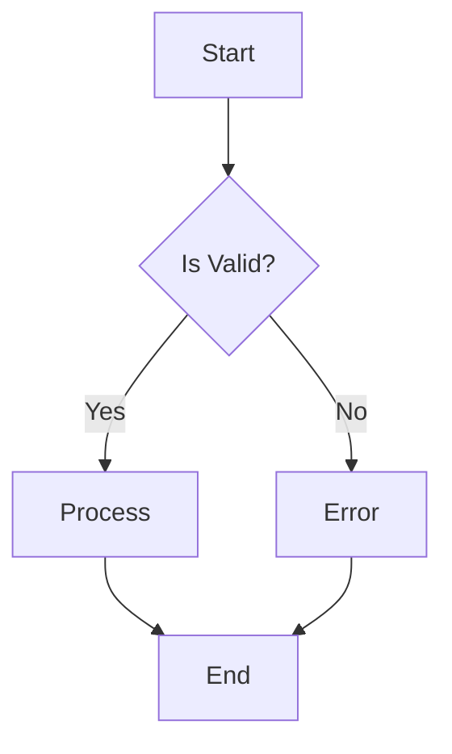
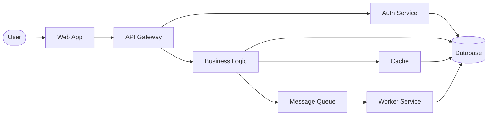
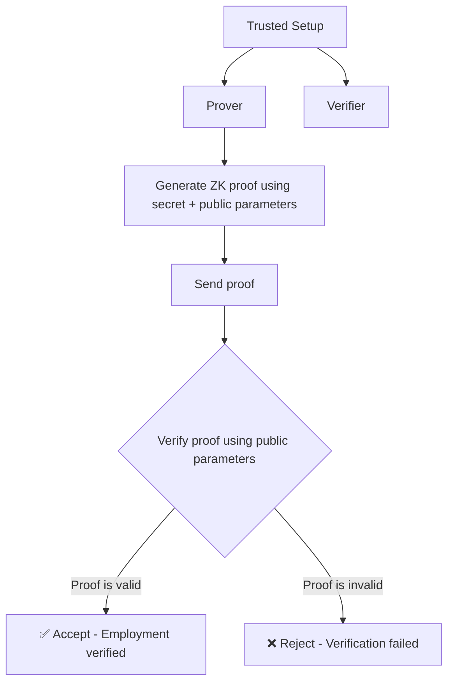
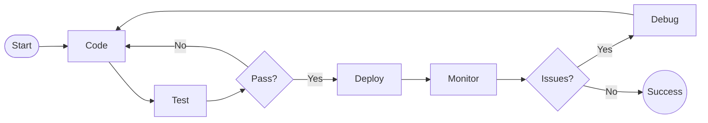

# RenderMaid Markdown Examples

This document demonstrates how RenderMaid can parse and render Mermaid diagrams embedded in markdown files.

## Basic Flowchart

Here's a simple flowchart showing a basic decision process:



## Complex System Architecture

This diagram shows a more complex system with multiple components:



## Zero-Knowledge Proof Verification

A cryptographic workflow demonstrating zero-knowledge proof verification:



## Development Workflow

A typical software development workflow:



## Usage Instructions

To parse diagrams from this markdown file using RenderMaid:

```typescript
import { parseMermaidFromMarkdownFile } from "@rendermaid/core";

const result = await parseMermaidFromMarkdownFile("examples/markdown-examples.md");

if (result.success) {
  console.log(`Found ${result.data.length} diagrams`);
  
  result.data.forEach((ast, index) => {
    console.log(`Diagram ${index + 1}:`);
    console.log(`  Nodes: ${ast.nodes.size}`);
    console.log(`  Edges: ${ast.edges.length}`);
  });
}
```

## Features Demonstrated

- ✅ Multiple diagrams in single file
- ✅ Different diagram complexities
- ✅ Various node shapes (rectangles, rhombus, circles, etc.)
- ✅ Edge labels and conditional flows
- ✅ Real-world use cases (auth, crypto, DevOps)
- ✅ Proper markdown formatting
- ✅ Code examples for usage

This file contains **4 Mermaid diagrams** that can be automatically extracted and rendered by RenderMaid's markdown parsing functionality.
